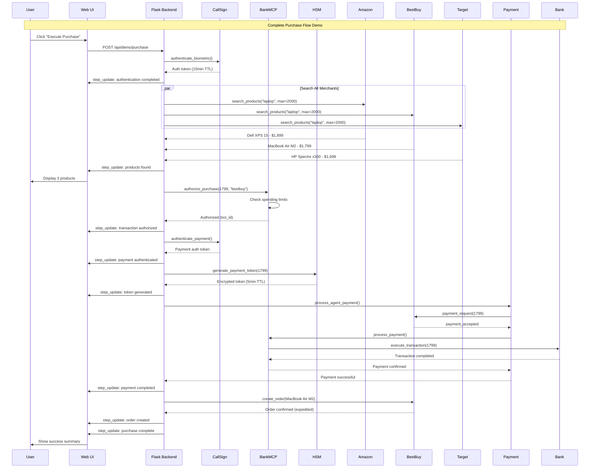
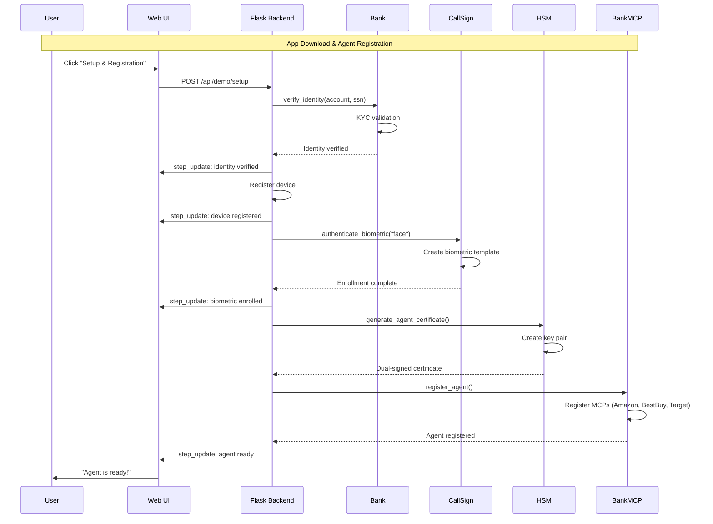
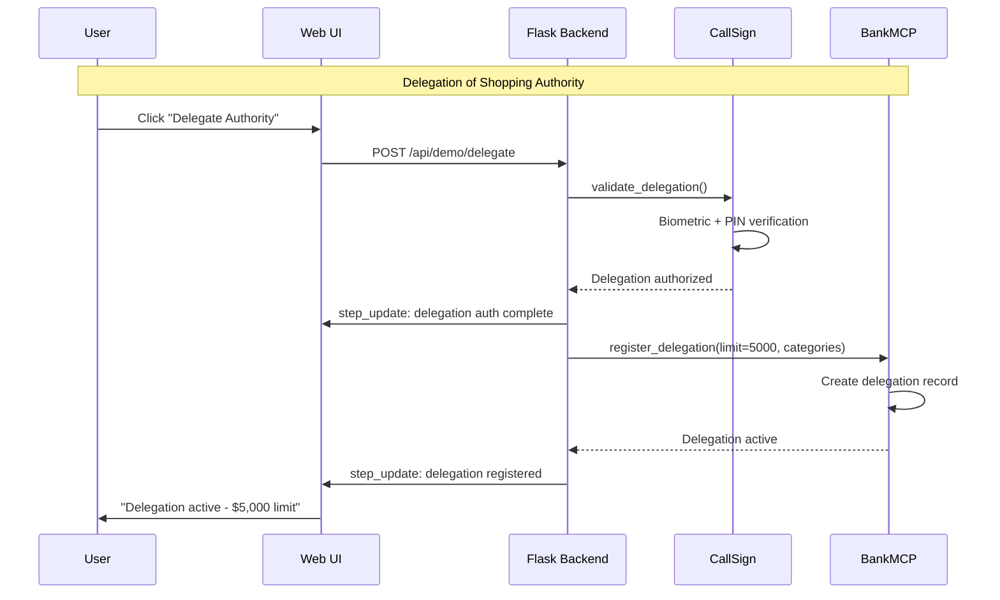
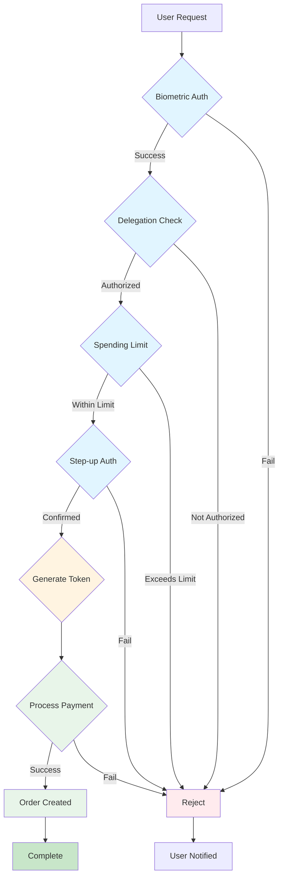
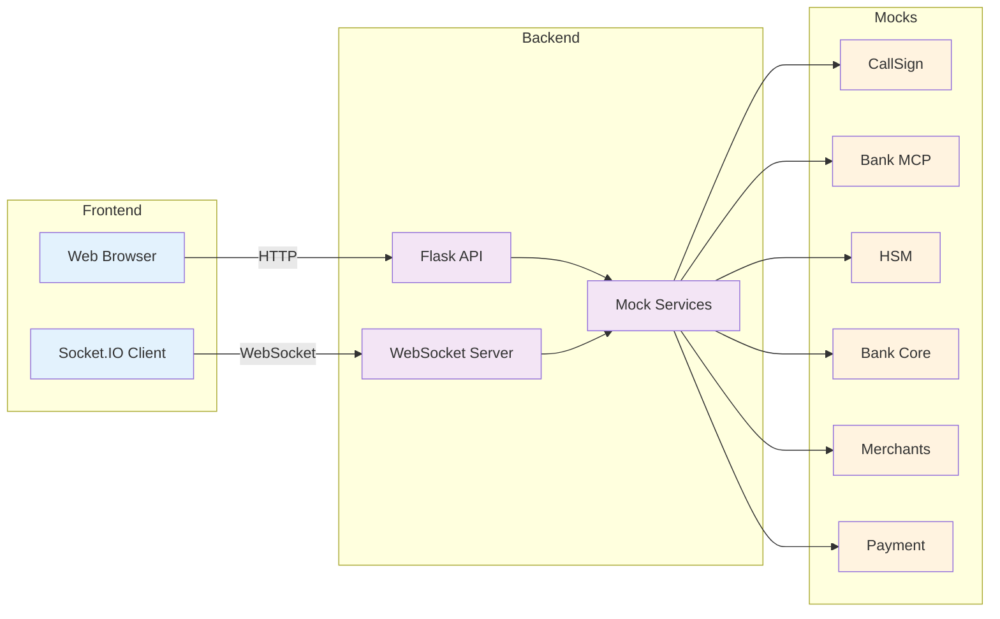
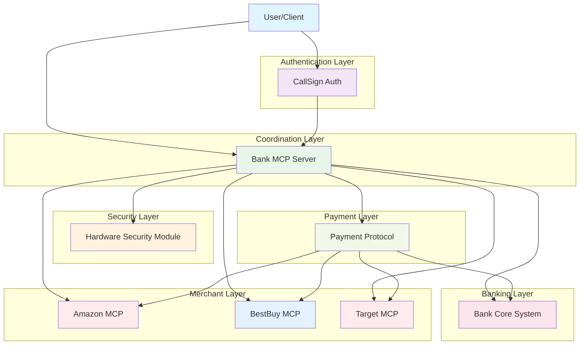
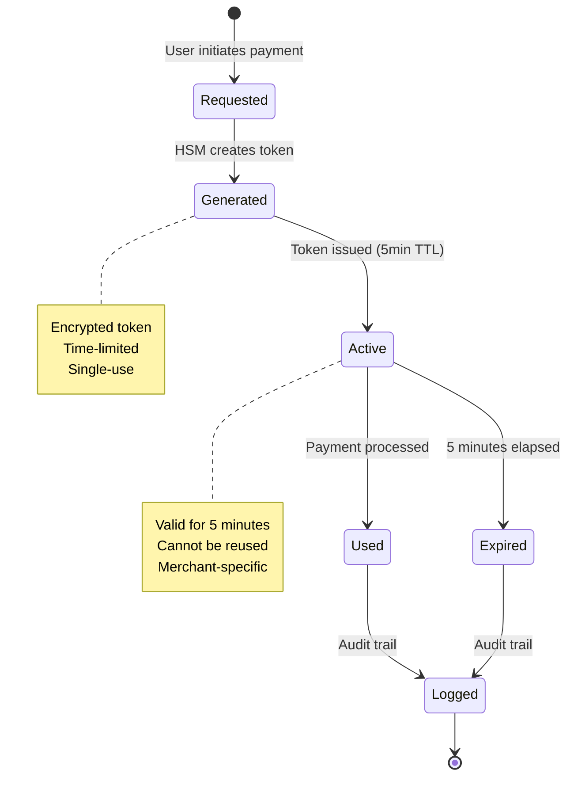
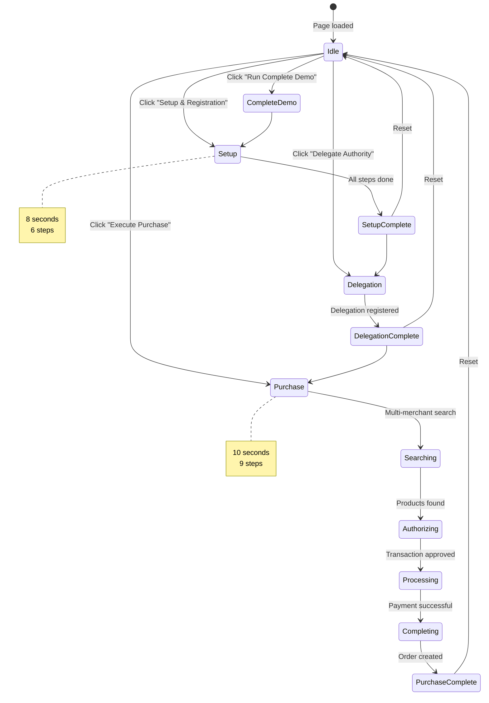

# Visual Sequence Diagrams

## Complete Purchase Flow



## Setup & Registration Flow



## Delegation Flow



## Security Checkpoints



## Data Flow Architecture



## Entity Interaction Map



## Token Lifecycle



## Demo State Machine



---

## How to Use These Diagrams

### During Presentation

1. **Show Complete Purchase Flow** first
   - Demonstrates end-to-end process
   - Highlights all entities
   - Shows parallel processing

2. **Explain Security Checkpoints**
   - Visual representation of security layers
   - Easy for non-technical audience

3. **Show Entity Interaction Map**
   - Architecture overview
   - System components
   - Integration points

### For Technical Discussions

1. **Data Flow Architecture**
   - Frontend/Backend separation
   - WebSocket real-time updates
   - Mock service layer

2. **Token Lifecycle**
   - Security model
   - Time-limited credentials
   - Audit trail

3. **State Machine**
   - Demo flow logic
   - User interactions
   - State transitions

---

## Rendering Options

### In Markdown Viewers
- GitHub
- GitLab
- VS Code (with Mermaid extension)
- Obsidian

### Export to Images
```bash
# Using mermaid-cli
npm install -g @mermaid-js/mermaid-cli
mmdc -i SEQUENCE_DIAGRAM.md -o diagrams.pdf
```

### Live Rendering
- Mermaid Live Editor: https://mermaid.live
- Copy/paste diagrams for editing

---

**Use these diagrams to enhance your client presentation!**
