# Complete User Lifecycle: App Download to Purchase

## Full Lifecycle Flow

# Purchase Transaction Sequence Diagram

```mermaid
sequenceDiagram
    participant User
    participant MobileAgent as Mobile Agent
    participant CallSign as CallSign Auth
    participant BankMCP as Bank MCP Server
    participant AmazonMCP as Amazon MCP Server
    participant PaymentProtocol as Google Payment Protocol
    participant HSM as Hardware Security Module
    participant Bank as Bank Core System

    Note over User, Bank: User Purchase Request: "Buy a laptop under $2000 from Amazon"

    %% Authentication Phase
    User->>MobileAgent: "Buy laptop under $2000 from Amazon"
    MobileAgent->>CallSign: Biometric authentication request
    CallSign->>CallSign: Face/voice/behavior validation
    CallSign-->>MobileAgent: Authentication token (15min TTL)
    
    %% Product Search Phase
    MobileAgent->>AmazonMCP: search_products(query="laptop", max_price=2000)
    AmazonMCP->>AmazonMCP: Search product catalog
    AmazonMCP-->>MobileAgent: Product list with prices
    MobileAgent-->>User: "Found 5 laptops. Dell XPS 15 for $1,899?"
    User->>MobileAgent: "Yes, buy the Dell XPS"
    
    %% Transaction Authorization Phase
    MobileAgent->>BankMCP: authorize_purchase(amount=1899, merchant="amazon")
    BankMCP->>BankMCP: Validate dual-signed certificate
    BankMCP->>BankMCP: Check spending limits & merchant whitelist
    BankMCP-->>MobileAgent: Authorization approved (txn_id: AUTH_456)
    
    %% Payment Processing Phase
    MobileAgent->>CallSign: Step-up authentication for payment
    CallSign->>User: Additional biometric confirmation
    User->>CallSign: Biometric confirmation
    CallSign-->>MobileAgent: Payment authorization token
    
    %% Secure Credential Retrieval
    MobileAgent->>BankMCP: get_payment_credentials(txn_id=AUTH_456)
    BankMCP->>HSM: Generate time-limited payment token
    HSM-->>BankMCP: Encrypted payment token (5min TTL)
    BankMCP-->>MobileAgent: Secure payment credentials
    
    %% Agent-to-Agent Payment Protocol
    MobileAgent->>PaymentProtocol: initiate_agent_payment(merchant_agent="amazon_agent")
    PaymentProtocol->>AmazonMCP: payment_request(amount=1899, currency="USD")
    AmazonMCP-->>PaymentProtocol: payment_accepted
    PaymentProtocol->>BankMCP: process_agent_payment(google_payment_token)
    
    %% Bank Processing
    BankMCP->>Bank: Execute payment transaction
    Bank->>Bank: Debit user account
    Bank->>Bank: Transfer to Amazon merchant account
    Bank-->>BankMCP: Transaction completed (txn_ref: PAY_789)
    
    %% Order Completion
    BankMCP-->>PaymentProtocol: Payment confirmed
    PaymentProtocol-->>AmazonMCP: Payment successful
    AmazonMCP->>AmazonMCP: Create order & initiate shipping
    AmazonMCP-->>MobileAgent: Order confirmation (order_id: ORD_123)
    
    %% User Notification
    MobileAgent-->>User: "✅ Purchase complete! Dell XPS 15 ordered for $1,899. Order #ORD_123. Estimated delivery: 2 days"
    
    %% Audit & Compliance
    Note over BankMCP, Bank: All transactions logged for compliance
    BankMCP->>BankMCP: Log transaction details
    BankMCP->>BankMCP: Update spending limits
    BankMCP->>BankMCP: Fraud monitoring check
```

## Key Security Checkpoints

1. **Initial Authentication**: CallSign biometric validation
2. **Transaction Authorization**: Dual-signed certificate + spending limits
3. **Payment Confirmation**: Step-up biometric authentication
4. **Credential Security**: HSM-generated time-limited tokens
5. **Agent Protocol**: Google Payment Protocol for secure agent communication
6. **Audit Trail**: Complete transaction logging for compliance

## Error Handling Scenarios

```mermaid
sequenceDiagram
    participant User
    participant MobileAgent as Mobile Agent
    participant BankMCP as Bank MCP Server
    
    Note over User, BankMCP: Error Scenario: Spending Limit Exceeded
    
    User->>MobileAgent: "Buy a $5000 laptop"
    MobileAgent->>BankMCP: authorize_purchase(amount=5000)
    BankMCP->>BankMCP: Check spending limits (daily: $2000)
    BankMCP-->>MobileAgent: Authorization denied (reason: "exceeds_daily_limit")
    MobileAgent-->>User: "❌ Purchase denied. Daily limit is $2000. Current available: $1,200"
    
    Note over User, BankMCP: Alternative: Request Approval
    
    User->>MobileAgent: "Request approval for $5000 purchase"
    MobileAgent->>BankMCP: request_approval(amount=5000, reason="laptop_purchase")
    BankMCP-->>MobileAgent: Approval request submitted (approval_id: APR_789)
    MobileAgent-->>User: "📋 Approval requested. You'll receive SMS confirmation within 5 minutes"
```

